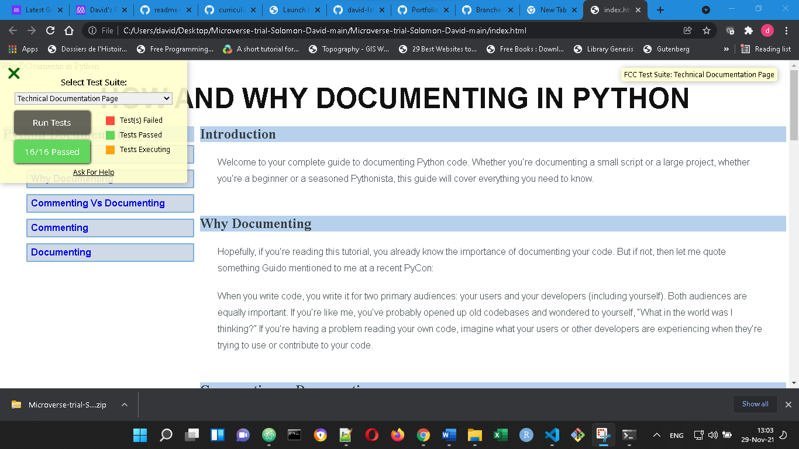

# HOW AND WHY DOCUMENTING IN PYTHON

> This project was made in the context of Microverse trial by Solomon Muwanguzi an David Lafontant. It is technical documentation page that comply at that time with freecocamp html/css project requirements

the project Additional description and its features.

## Built With

- HTML
- CSS

## Getting Started

Clone the project from Github and run it from your local repository

### Prerequisites

Have git setup on the local machine

### Usage

Personnal usage

### Run tests

Test on codepen or on the local machin

## Authors

👤 **Author1**

- GitHub: [@david-lafontant](https://github.com/david-lafontant)
- Twitter: [@manikatex](https://twitter.com/manikatex)

👤 **Author2**

- GitHub: [@muwasol](https://github.com/muwasol)

## 🤝 Contributing

Contributions, issues, and feature requests are welcome!

## Show your support

Give a ⭐️ if you like this project!

## Acknowledgments

Hat tip to : The authors/contributors of the Microverse README.md template: @nidalaa nidalaa Emilia Andrzejewska @davidauza-engineer davidauza-engineer David Auza @kethinov kethinov Eric Newport @fernandorpm fernandorpm Fernando Marques

Hat tip also to my partnet for this project at the trials: @muwasol

## 📝 License

This project is [MIT](./MIT.md) licensed.
